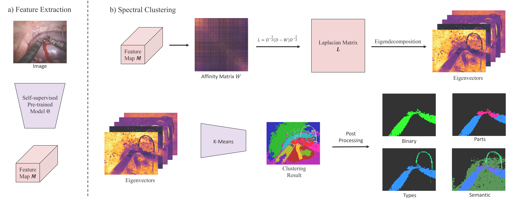

# SpecClusteringSIS

[Paper (not released yet)](https_link).

## Method Overview



## Setup
* Recommended Environment: Python 3.10.0+, Cuda 12.0+
* Install dependencies: `pip install -r requirements.txt`.

## Dataset Directory
```
dataset
    └── DatasetName
        ├── groundTruth
        │   ├── binary
        │   │   ├── videoName1
        │   │   |   ├── frameName1.png
        │   │   |   └── frameName2.png
        │   │   └── videoName2
        │   ├── binaryClassIndicator.json
        │   ├── parts
        │   ├── partsClassIndicator.json
        │   ├── semantic
        │   ├── semanticClassIndicator.json
        │   ├── types
        │   └── typesClassIndicator.json
        └── inputX
            └── originImage
                ├── videoName1
                |   ├── frameName1.png
                |   └── frameName2.png
                └── videoName2
```
A tiny dataset is uploaded and is named "Demo".

`groundTruth`: Ground truth masks and class indicators (json files) for all segmentation tasks are stored.

`inputX`: Origin input frames are stored.

## Data Splitting

Run `python data_train_val_test_split.py --config_file configFiles/DeepSpectral_Demo.json`.
All datasets and their configuration are listed in the config file, including the training and testing sets.
It will generate several `txt` files listing samples used for training or testing, such as `train_samples.txt` used for training, `test_separate_samples.txt` used for testing and `sample_samples.txt` used for visualizing. Our method is fully unsupervised based on spectral clustering, so no training in our study.

Or, you can manually set `txt` files.

## Run

Run `python main.py --config_file configFiles/DeepSpectral_Demo.json`.
Change configurations in the config file for more experiments.

## Outputs

A directory `outputs` will be generated after running.

```
outputs
    └── ConfigFileName
        └── random_seed-xxxx
            ├── DatasetName
            │   ├── sample
            │   │   ├── affinity_matrix
            │   │   │   └── videoName1
            │   │   │       ├── frameName1.png
            │   │   │       └── frameName2.png
            │   │   ├── eigenvectors
            │   │   │   └── videoName1
            │   │   │       ├── frameName1
            │   │   │       │   ├── 1-th_eigenvector.png
            │   │   │       │   ├── 2-th_eigenvector.png
            │   │   │       └── frameName2
            │   │   ├── gt_seg_overlay
            │   │   │   └── videoName1
            │   │   │       ├── frameName1.png
            │   │   │       └── frameName2.png
            │   │   ├── pre_seg_color
            │   │   │   └── videoName1
            │   │   │       ├── frameName1.png
            │   │   │       └── frameName2.png
            │   │   ├── pre_seg_overlay
            │   │   │   └── videoName1
            │   │   │       ├── frameName1.png
            │   │   │       └── frameName2.png
            │   │   └── pre_seg_raw   (raw clustering result without post-processing)
            │   │       └── videoName1
            │   │           ├── frameName1.png
            │   │           └── frameName2.png
            └── logs
                ├── metrics.csv 
                └── single_img_miou.bin    (record miou for each image)
```


## Citation
Not released yet


